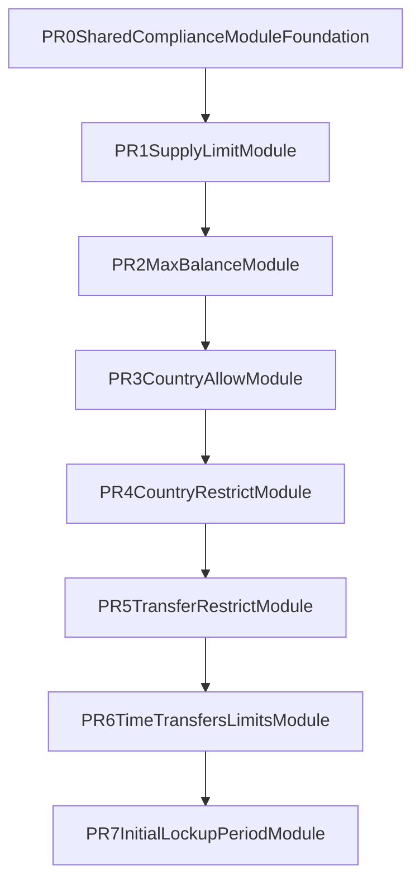

# RWA Compliance Modules PR Plan

## Objective

Port the **"Keep"** module set from the Notion scope into `stellar-contracts` with behavior aligned to T-REX semantics (functional parity + invariants), using **separate PRs per module** and a shared base PR.

Primary scope source: [RWA Compliance Modules](https://www.notion.so/openzeppelin/RWA-Compliance-Modules-314cbd1278608010b88dd0d913ece074?source=copy_link).

## Existing Integration Points (confirmed)

- Compliance interfaces + hook model: `[/Users/ghost/dev/repos/OpenZeppelin/stellar-contracts/packages/tokens/src/rwa/compliance/mod.rs](/Users/ghost/dev/repos/OpenZeppelin/stellar-contracts/packages/tokens/src/rwa/compliance/mod.rs)`
- Compliance dispatch + registration storage: `[/Users/ghost/dev/repos/OpenZeppelin/stellar-contracts/packages/tokens/src/rwa/compliance/storage.rs](/Users/ghost/dev/repos/OpenZeppelin/stellar-contracts/packages/tokens/src/rwa/compliance/storage.rs)`
- Current compliance tests + mock module pattern: `[/Users/ghost/dev/repos/OpenZeppelin/stellar-contracts/packages/tokens/src/rwa/compliance/test.rs](/Users/ghost/dev/repos/OpenZeppelin/stellar-contracts/packages/tokens/src/rwa/compliance/test.rs)`
- Reusable primitives:
  - Supply cap: `[/Users/ghost/dev/repos/OpenZeppelin/stellar-contracts/packages/tokens/src/fungible/extensions/capped/storage.rs](/Users/ghost/dev/repos/OpenZeppelin/stellar-contracts/packages/tokens/src/fungible/extensions/capped/storage.rs)`
  - Allow/block patterns: `[/Users/ghost/dev/repos/OpenZeppelin/stellar-contracts/packages/tokens/src/fungible/extensions/allowlist/storage.rs](/Users/ghost/dev/repos/OpenZeppelin/stellar-contracts/packages/tokens/src/fungible/extensions/allowlist/storage.rs)`, `[/Users/ghost/dev/repos/OpenZeppelin/stellar-contracts/packages/tokens/src/fungible/extensions/blocklist/storage.rs](/Users/ghost/dev/repos/OpenZeppelin/stellar-contracts/packages/tokens/src/fungible/extensions/blocklist/storage.rs)`
  - Country data model: `[/Users/ghost/dev/repos/OpenZeppelin/stellar-contracts/packages/tokens/src/rwa/identity_registry_storage/storage.rs](/Users/ghost/dev/repos/OpenZeppelin/stellar-contracts/packages/tokens/src/rwa/identity_registry_storage/storage.rs)`

## Delivery Structure (stacked)

## PR0 — Shared Compliance Module Foundation

- Add module namespace + exports under `[/Users/ghost/dev/repos/OpenZeppelin/stellar-contracts/packages/tokens/src/rwa/compliance/](/Users/ghost/dev/repos/OpenZeppelin/stellar-contracts/packages/tokens/src/rwa/compliance/)`:
  - `modules/mod.rs`
  - `modules/common.rs` (shared storage keys/helpers, bounded-vector helpers, common auth helpers)
  - `modules/test_utils.rs` (token/compliance bootstrap and reusable assertions)
- Wire exports in `[/Users/ghost/dev/repos/OpenZeppelin/stellar-contracts/packages/tokens/src/rwa/compliance/mod.rs](/Users/ghost/dev/repos/OpenZeppelin/stellar-contracts/packages/tokens/src/rwa/compliance/mod.rs)`.
- Add baseline contract test scaffolding pattern for real modules (separate from existing `MockComplianceModule` tests).

## Module PRs (one PR each)

### PR1 — SupplyLimitModule

- Implement module contract in `compliance/modules/supply_limit.rs` with per-token cap configuration and `can_create` enforcement.
- Hook usage: primary `CanCreate` (optional `Created/Destroyed` bookkeeping only if required by exact T-REX semantics).
- Tests: cap set/update, exact-bound mint, over-cap reject, multi-token isolation.

### PR2 — MaxBalanceModule

- Implement `compliance/modules/max_balance.rs`.
- Hook usage: `CanTransfer` and `CanCreate` (recipient post-balance bound).
- Tests: inbound transfer/mint at bound and over bound, identity/account handling decisions documented if Soroban constraints diverge from EVM identity granularity.

### PR3 — CountryAllowModule

- Implement `compliance/modules/country_allow.rs`.
- Hook usage: `CanTransfer`, `CanCreate`.
- Integrate reads against identity/country registry interfaces (through existing RWA identity storage contract addressing).
- Tests: allowed-country pass, non-allowed-country reject, country updates reflected immediately.

### PR4 — CountryRestrictModule

- Implement `compliance/modules/country_restrict.rs`.
- Hook usage: `CanTransfer`, `CanCreate`.
- Mirror CountryAllow behavior with inverse semantics.
- Tests: restricted-country reject, non-restricted pass, compatibility with CountryAllow when both registered.

### PR5 — TransferRestrictModule

- Implement `compliance/modules/transfer_restrict.rs`.
- Hook usage: `CanTransfer`.
- Whitelist semantics aligned with T-REX module behavior.
- Tests: sender/recipient matrix, dynamic list updates, composition with other `CanTransfer` modules.

### PR6 — TimeTransfersLimitsModule

- Implement `compliance/modules/time_transfers_limits.rs`.
- Hook usage: `CanTransfer` + `Transferred` (window validation + accounting updates).
- Storage strategy: bounded rolling windows and cleanup policy inspired by existing spending-limit patterns.
- Tests: within-window cap, rollover behavior, multiple windows, boundary timestamps/ledgers.

### PR7 — InitialLockupPeriodModule

- Implement `compliance/modules/initial_lockup_period.rs`.
- Hook usage: `Created` (record lock start) + `CanTransfer` (enforce lock until expiry).
- Tests: pre-expiry reject, exact expiry pass, additional mint interactions during active lock.

## Common Rules Applied To Every Module PR

- Maintain T-REX behavior parity at functional level; where EVM/Soroban mechanics differ, preserve business rule intent and document the mapping in module docs.
- Keep module state namespaced by token address for multi-token-safe compliance contracts.
- Ensure state-changing hooks enforce caller/auth expectations via compliance-address checks where needed.
- Add dedicated test file per module and include composability tests with at least one other module.
- Keep PRs narrowly scoped: one module + docs/tests only.

## Validation & Review Gates Per PR

- Unit tests for module logic and hook behavior.
- Regression check of existing compliance tests (no behavior break in registry/dispatch).
- API/documentation update for module exposure and usage.
- PR description must include: T-REX source mapping table (function-by-function), known Soroban adaptation notes, and invariants covered by tests.

## Deliverables

- 1 shared foundation PR.
- 7 standalone module PRs:
  1. SupplyLimit
  2. MaxBalance
  3. CountryAllow
  4. CountryRestrict
  5. TransferRestrict
  6. TimeTransfersLimits
  7. InitialLockupPeriod
