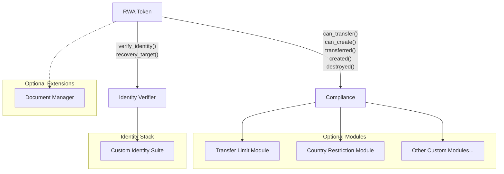
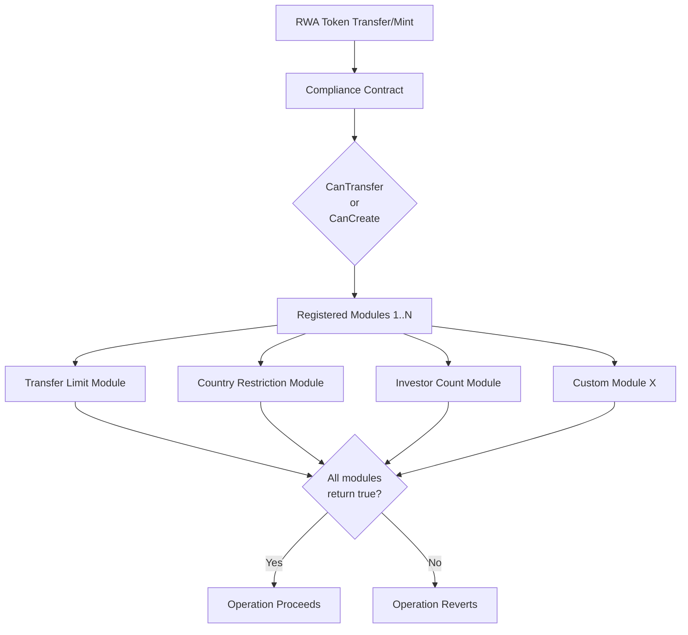
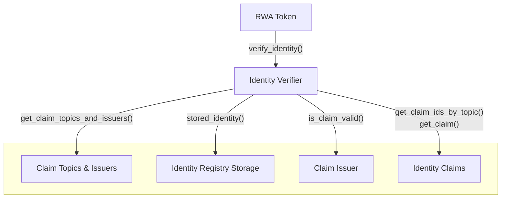
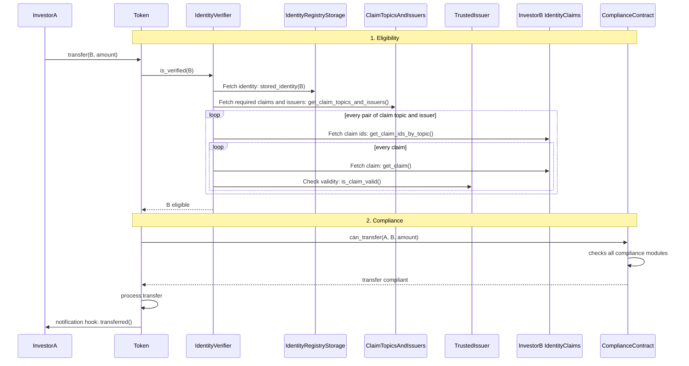

[Source Code](https://github.com/OpenZeppelin/stellar-contracts/tree/main/packages/tokens/src/rwa)

Real World Asset (RWA) tokens are security tokens that represent ownership or rights to real-world assets such as
real estate, commodities, securities, or other regulated financial instruments. These tokens must comply with various
regulatory requirements including KYC/AML verification, transfer restrictions, and compliance rules. The RWA suite
provides a comprehensive framework based on the T-REX (Token for Regulated Exchanges) standard,
which implements the [ERC-3643](https://docs.erc3643.org/erc-3643) specification.

## Overview

The [RWA](https://github.com/OpenZeppelin/stellar-contracts/tree/main/packages/tokens/src/rwa) suite
provides a complete implementation of regulated security tokens with built-in compliance,
identity verification, and administrative controls. The suite is designed to be flexible and extensible,
allowing integration with various identity registry and compliance frameworks.

The RWA token extends the standard fungible token functionality with regulatory features required for
security tokens, including:

- **Identity Management**: Integration with identity registries for KYC/AML compliance
- **Compliance Framework**: Modular compliance rules and validation for transfers and minting
- **Transfer Controls**: Sophisticated transfer restrictions and validations
- **Freezing Mechanisms**: Address-level and partial token freezing capabilities
- **Recovery System**: Lost/old account recovery for verified investors
- **Pausable Operations**: Emergency pause functionality for the entire token
- **Role-Based Access Control (RBAC)**: Flexible privilege management for administrative functions

## Architecture

The RWA suite follows a modular architecture that separates concerns and allows for flexible integration




### Core Components

1. **RWA Token Contract**: The main token contract implementing the `RWAToken` trait, which extends both
`FungibleToken` and `Pausable` traits.

2. **Identity Verifier**: A separate contract responsible for verifying user identities.
The RWA token expects the following function to be available: `fn verify_identity(e: &Env, account: &Address);`.

3. **Compliance Contract**: A separate contract that validates transfers, minting, and burning operations.
The RWA token expects the following functions to be available:
    - `fn can_transfer(e: &Env, from: Address, to: Address, amount: i128, token: Address) -> bool;`
    - `fn can_create(e: &Env, to: Address, amount: i128, token: Address) -> bool;`
    - `fn created(e: &Env, to: Address, amount: i128, token: Address);`
    - `fn destroyed(e: &Env, from: Address, amount: i128, token: Address);`
    - `fn transferred(e: &Env, from: Address, to: Address, amount: i128, token: Address);`

This loose coupling between the RWA token and the modules allows the following:
- Share identity verifier and compliance contracts across multiple RWA tokens
- Implement custom identity verification approaches (Merkle trees, zero-knowledge proofs, claim-based, etc.)
- Create modular compliance rules that can be composed and reused

### Supporting Modules

The module provides default implementations for common use cases:

- **Claim Topics and Issuers**: Manages trusted claim issuers and claim types (e.g., KYC=1, AML=2)
- **Identity Claims**: Integration with identity registries for cryptographic claim validation
- **Identity Registry Storage**: Registry for storing identity information and country relations
- **Claim Issuer**: Validates cryptographic claims with multiple signature schemes (Ed25519, Secp256k1, Secp256r1)
- **Compliance**: Modular compliance framework with hook-based architecture

## Usage

We'll create a regulated security token for tokenized real estate shares. The token requires KYC verification,
implements transfer restrictions, and provides administrative controls for compliance.

Here's what a basic RWA token contract might look like (only the base token contract, not the modules):

```rust
use soroban_sdk::{contract, contractimpl, symbol_short, Address, Env, String};
use stellar_access::access_control::{self as access_control, AccessControl};
use stellar_macros::default_impl;
use stellar_tokens::{
    fungible::{Base, FungibleToken},
    rwa::{RWAToken, RWA},
};

#[contract]
pub struct RealEstateToken;

#[contractimpl]
impl RealEstateToken {
    pub fn __constructor(
        e: &Env,
        admin: Address,
        manager: Address,
        compliance: Address,
        identity_verifier: Address,
        initial_supply: i128,
    ) {
        // Set token metadata
        Base::set_metadata(
            e,
            18, // 18 decimals
            String::from_str(e, "Real Estate Token"),
            String::from_str(e, "REST"),
        );

        // Set compliance and identity verifier contracts
        RWA::set_compliance(e, &compliance);
        RWA::set_identity_verifier(e, &identity_verifier);

        // Set up access control
        access_control::set_admin(e, &admin);

        // Create a "manager" role and grant it to the manager address
        access_control::grant_role_no_auth(e, &admin, &manager, &symbol_short!("manager"));

        // Mint initial supply to the admin (must be a verified identity)
        RWA::mint(e, &admin, initial_supply);
    }
}

// Implement the FungibleToken trait with RWA contract type
#[default_impl]
#[contractimpl]
impl FungibleToken for RealEstateToken {
    type ContractType = RWA;
}

// Implement the RWAToken trait for regulatory features
#[default_impl]
#[contractimpl]
impl RWAToken for RealEstateToken {}

// Implement AccessControl for role-based permissions
#[default_impl]
#[contractimpl]
impl AccessControl for RealEstateToken {}
```

## Key Features

### Identity Verification

Identity Verification is handled on a separate contract as a module.

All token recipients must have verified identities before receiving tokens. The RWA token integrates
with an identity verifier contract that validates user identities against cryptographic claims.

Every token operation that involves receiving tokens (mint, transfer, recovery) automatically calls the
identity verifier contract to ensure the recipient has a valid identity with the required claims (KYC, AML, etc.).

```rust
// Example: Minting tokens
// Internally calls: identity_verifier.verify_identity(&recipient)
// Then calls: compliance.can_create(&recipient, &amount)
// Finally calls: compliance.created(&recipient, &amount) after minting
RWA::mint(e, &recipient, amount);

// Example: Transferring tokens
// Internally calls: identity_verifier.verify_identity(&from)
// Then calls: identity_verifier.verify_identity(&to)
// Then calls: compliance.can_transfer(&from, &to, &amount)
// Finally calls: compliance.transferred(&from, &to, &amount) after transfer
RWA::transfer(e, &from, &to, amount);

// Example: Wallet recovery for lost/old accounts
// Internally calls: identity_verifier.verify_identity(&new_account)
// Then calls: identity_verifier.recovery_target(&old_account) to verify the new account
//             is the authorized recovery target for the old account
// Transfers all tokens and preserves frozen status
RWA::recover_balance(e, &old_account, &new_account, &operator);
```

**Identity Verification Flow:**
1. The RWA token calls `identity_verifier.verify_identity(&address)`
2. The identity verifier checks if the address has a registered identity
3. The identity verifier validates that the identity has all required claims from trusted issuers
4. If verification fails, the entire operation reverts with `IdentityVerificationFailed` error

### Compliance Validation

Compliance Validation is handled on a separate contract as a module.

The compliance framework allows you to implement custom transfer and minting rules through a modular hook system:

- **CanTransfer**: Validates if a transfer should be allowed
- **CanCreate**: Validates if a mint operation should be allowed
- **Transferred**: Updates state after a successful transfer
- **Created**: Updates state after a successful mint
- **Destroyed**: Updates state after a successful burn

### Freezing Mechanisms

Freezing Mechanisms are handled on the RWA token contract.

RWA tokens support two types of freezing:

1. **Address-level freezing**: Completely freeze an address from sending or receiving tokens
2. **Partial token freezing**: Freeze a specific amount of tokens for an address

```rust
// Freeze an entire address
RWA::set_address_frozen(e, &user_address, bool, &operator);

// Freeze a specific amount of tokens
RWA::freeze_partial_tokens(e, &user_address, amount, &operator);

// Unfreeze tokens
RWA::unfreeze_partial_tokens(e, &user_address, amount, &operator);
```

### Recovery System

The recovery system allows authorized operators to transfer tokens from a lost/old account to a
new account for the same verified investor:

Balance Recovery System is handled on the RWA token contract, whereas Identity Recovery System is handled
on a separate contract as a module (may be a part of the Identity Registry contract).

```rust
// Recover tokens from old account to new account
RWA::recover_balance(e, &old_account, &new_account, &operator);
```

### Forced Transfers

Forced Transfers are handled on the RWA token contract.

Authorized operators can force transfers between verified wallets for regulatory compliance:

```rust
// Force a transfer for regulatory reasons
RWA::forced_transfer(e, &from, &to, amount, &operator);
```

## Modules

The RWA package includes several supporting modules that work together to provide comprehensive regulatory compliance:

### - Compliance
[Source Code](https://github.com/OpenZeppelin/stellar-contracts/tree/main/packages/tokens/src/rwa/compliance)

This is a mandatory module, since RWA token contract expects the compliance checks and hooks to be available.

Provides a modular framework for implementing custom compliance rules through a hook-based architecture where multiple
[compliance modules](https://github.com/OpenZeppelin/stellar-contracts/blob/main/packages/tokens/src/rwa/compliance/mod.rs#L327)
can be registered to the [Compliance Contract](https://github.com/OpenZeppelin/stellar-contracts/blob/main/packages/tokens/src/rwa/compliance/mod.rs#L67).

**Compliance Validation Flow:**



The compliance contract is designed to be shared across multiple RWA tokens, with each hook function accepting a
`token` parameter to identify the calling token.

### - Identity Verifier
[Source Code](https://github.com/OpenZeppelin/stellar-contracts/tree/main/packages/tokens/src/rwa/identity_verifier)

This is a mandatory module, since RWA token contract expects `verify_identity(e: &Env, address: Address)`
function to be available.

The **Identity Verifier Module** provides the interface for verifying user identities.
It can also support possible custom implementation approaches:

- **Claim-based**: Cryptographic claims from trusted issuers (provided default implementation)
- **Merkle Tree**: Efficient verification using merkle proofs
- **Zero-Knowledge**: Privacy-preserving verification with custom ZK circuits
- **Other custom approaches**: Any implementation that satisfies the `verify_identity` interface

The diagram below illustrates how identity verification works in the claim-based identity stack:



### - Claim Topics and Issuers
[Source Code](https://github.com/OpenZeppelin/stellar-contracts/tree/main/packages/tokens/src/rwa/claim_topics_and_issuers)

This module is an implementation detail. It is provided as the suggested implementation for the **Claim-based** approach.

Acts as the trust registry that defines which claim topics are required and which issuers are authorized to provide those claims.

Key features/responsibilities of the **Claim Topics and Issuers Module** are:
  - **Claim Topic Registry**: Defines which types of claims are required for token participation (e.g., KYC=1, AML=2, Accredited Investor=3)
  - **Trusted Issuer Registry**: Maintains a list of authorized claim issuers (e.g., KYC providers, compliance firms)
  - **Authorization Mapping**: Maps each trusted issuer to the specific claim topics they are authorized to issue
    - Example: Issuer A can issue KYC and AML claims, but not Accreditation claims
    - Example: Issuer B can only issue Accreditation claims
  - **Multi-Token Support**: Can be shared across multiple RWA tokens, reducing deployment costs

**Configuration Example:**
```rust
// Add claim topics
add_claim_topic(e, 1, operator); // KYC
add_claim_topic(e, 2, operator); // AML
add_claim_topic(e, 3, operator); // Accredited Investor

// Add trusted issuer with authorized topics
add_trusted_issuer(e, issuer_a, vec![1, 2], operator); // Can issue KYC and AML
add_trusted_issuer(e, issuer_b, vec![3], operator);    // Can only issue Accreditation
```

#### Understanding Claims

**What is a Claim?**

A claim is a cryptographically signed attestation made by a trusted authority (claim issuer) about a specific aspect
of an identity. Think of it as a digital certificate that proves something about an investor.

**Claim Structure:**

Each claim contains:
- **Topic**: A numeric identifier for what the claim attests to (e.g., KYC=1, AML=2, Accredited Investor=3)
- **Issuer**: The address of the trusted authority that issued the claim
- **Signature**: Cryptographic proof that the issuer created this claim
- **Data**: The actual claim information (can include expiration dates, metadata)
- **Scheme**: The signature algorithm used (Ed25519, Secp256k1, Secp256r1)
- **Uri**: Optional URI for additional information

**How Claims Work:**

1. **Off-chain Verification**: KYC Provider verifies investor's identity documents off-chain
2. **Off-chain Signing**: KYC Provider signs the claim with their private key off-chain
3. **On-chain Storage**: Signed claim is stored in the investor's Identity Contract
4. **Token Validation**: When investor attempts to receive tokens, the RWA Token:
   - Retrieves claims from the Identity Contract
   - Calls the Claim Issuer Contract to validate signatures
   - Checks for revocations (stored in Claim Issuer Contract)
   - Verifies the issuer is trusted (via Claim Topics and Issuers registry)

**Note:** The KYC Provider and Claim Issuer are the same entity. Signing happens off-chain; only the signed claim and revocation data are stored on-chain.


### - Identity Registry Storage
[Source Code](https://github.com/OpenZeppelin/stellar-contracts/tree/main/packages/tokens/src/rwa/identity_registry_storage)

This module is an implementation detail. It is provided as the suggested implementation for the **Claim-based** approach.

Stores identity information for verified investors, including:

- Mapping of wallet addresses to onchain identity contracts
- Country information for regulatory compliance
- Support for both individual and organizational identities
- Recovery account mappings for lost wallet scenarios

### - Identity Claims
[Source Code](https://github.com/OpenZeppelin/stellar-contracts/tree/main/packages/tokens/src/rwa/identity_claims)

This module is an implementation detail. It is provided as the suggested implementation for the **Claim-based** approach.

Manages on-chain identity claims with cryptographic signatures.

This module can be used to extend or be embedded in identity systems.

<Callout type="info">
This contract is under the control of the investors themselves, who are responsible for storing their claims and corresponding signatures. This gives investors ownership of their identity data.
</Callout>

Claims are issued by trusted authorities and contain:

- Claim topic (e.g., KYC, AML)
- Claim data (encrypted or hashed information)
- Cryptographic signature
- Issuer information

### - Claim Issuer
[Source Code](https://github.com/OpenZeppelin/stellar-contracts/tree/main/packages/tokens/src/rwa/claim_issuer)

This module is an implementation detail. It is provided as the suggested implementation for the **Claim-based** approach.

Validates cryptographic claims and provides comprehensive claim lifecycle management. The module includes:

**Signature Verification:**
- Ed25519 (Stellar native)
- Secp256k1 (Ethereum compatible)
- Secp256r1 (Enterprise PKI compatible)

**Key Management:**
- Topic-specific key authorization with registry tracking
- Each public key is tied to a signature scheme
- A signing key (public key + scheme) can be authorized to sign claims for specific topic and registry combinations
- The same signing key can be authorized across multiple topics and registries independently

**Claim Invalidation Mechanisms:**
- **Passive Expiration**: Helper functions to encode/decode expiration metadata (`created_at` and `valid_until` timestamps) within claim data, allowing claims to automatically expire without on-chain action
- **Per-claim Revocation**: Fine-grained revocation of individual claims for precise control
- **Signature Invalidation**: Efficient bulk invalidation via nonce increment for revoking all claims signed by a specific key

## Extensions

The following optional extensions are provided:

### - Document Manager
[Source Code](https://github.com/OpenZeppelin/stellar-contracts/tree/main/packages/tokens/src/rwa/extensions/doc_manager)

This module is not mandatory.

The `DocumentManager` trait extends the `RWAToken` trait to provide document management capabilities following the
ERC-1643 standard. This extension allows contracts to:

- Attach documents with URI, hash, and timestamp
- Update existing document metadata
- Remove documents from the contract
- Retrieve individual or all documents

This is useful for attaching legal documents, prospectuses, or other regulatory disclosures to the token contract.

## Utility Modules

### - Token Binder
[Source Code](https://github.com/OpenZeppelin/stellar-contracts/tree/main/packages/tokens/src/rwa/utils/token_binder)

The `TokenBinder` trait provides a standardized interface for linking tokens to periphery contracts such as identity
registries and compliance contracts. This allows a single periphery contract to serve multiple RWA tokens.

Features:
- Bind/unbind tokens to periphery services
- Query all linked tokens
- Efficient storage with bucket-based architecture (supports up to 10,000 tokens)
- Swap-remove pattern for compact storage

## Architecture Overview

Now that we've covered each module individually, let's see how they work together. We'll walk through a `transfer()` operation to illustrate how the components interact:



## Security Considerations

When implementing RWA tokens, consider the following security aspects:

1. **Authorization**: All administrative functions expect RBAC checks to be enforced on the `operator` parameter
2. **Identity Verification**: Always verify identities before allowing token operations
3. **Compliance Validation**: Ensure compliance rules are properly configured before enabling transfers
4. **Freezing**: Use freezing mechanisms carefully as they lock user funds
5. **Recovery**: There are two distinct recovery flows, both requiring strict authorization:
   - **Identity Recovery**: Managed by the Identity Stack (Identity Registry Storage in Claim-Based approach), transfers the identity contract reference and profile (including country data) from old wallet to new wallet, and creates a recovery mapping
   - **Balance Recovery**: Managed by the RWA Token, transfers tokens from old to new account after verifying the identity recovery mapping exists (via `recovery_target()`)
6. **Pausability**: The pause mechanism should only be accessible to authorized administrators
7. **Contract Upgrades**: Consider following a secure upgrade strategy for your contracts. See: [Contract Upgrades](/stellar-contracts/utils/upgradeable)
