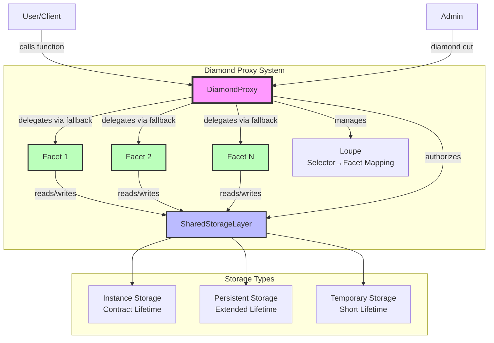

# Stellar Diamond Proxy

A Rust implementation of the [Diamond Pattern (EIP-2535)](https://eips.ethereum.org/EIPS/eip-2535) for Stellar/Soroban smart contracts. This pattern enables modular, upgradeable smart contracts with unlimited functionality while maintaining a single contract address and preserving state.

## 🌟 Key Features

- **Modular Architecture**: Split contract logic into multiple facets
- **Upgradeable**: Add, replace, or remove functionality without losing state
- **No Size Limits**: Overcome Soroban's contract size limitations
- **Shared Storage**: All facets share a unified storage layer
- **Authorization-Based Security**: Uses Stellar's native authorization context verification
- **Gas Efficient**: Deploy only the code you need
- **Type-Safe**: Leverages Rust's type system for safety
- **Well-Tested**: Comprehensive test suite with security validations

## 📋 Table of Contents

- [Architecture](#architecture)
- [Getting Started](#getting-started)
- [Project Structure](#project-structure)
- [Building & Testing](#building--testing)
- [Usage Guide](#usage-guide)
- [Security Model](#security-model)
- [Contributing](#contributing)
- [License](#license)

## 🏗️ Architecture

The Diamond Proxy pattern consists of several key components working together:



### Core Components

1. **DiamondProxy**: The main entry point that delegates calls to appropriate facets
2. **Facets**: Individual contracts containing specific functionality
3. **SharedStorageLayer**: Unified storage accessible by all facets
4. **DiamondFactory**: Deploys new diamond instances
5. **DiamondManager**: Optional convenience layer for diamond operations

## 🚀 Getting Started

### Prerequisites

- Rust 1.88.0 or later
- Cargo and cargo-make
- Stellar CLI (installed automatically by build scripts)
- wasm32-unknown-unknown target (`rustup target add wasm32-unknown-unknown`)

### Quick Start

1. **Clone the repository**
   ```bash
   git clone https://github.com/your-org/stellar-diamond-proxy.git
   cd stellar-diamond-proxy
   ```

2. **Build all contracts**
   ```bash
   cargo make build-wasm-and-optimize
   ```

3. **Run tests**
   ```bash
   cargo test
   ```

4. **Deploy to testnet**
   ```bash
   cargo make deploy-testnet stellar-diamond-factory
   ```

## 📁 Project Structure

```
stellar-contracts/
├── contracts/
│   ├── diamond-proxy/          # Main diamond proxy implementation
│   ├── diamond-manager/        # Convenience layer for diamond operations
│   ├── shared-storage/         # Shared storage layer for facets
│   ├── stellar-diamond-factory/# Factory for deploying diamonds
│   └── test-utils/            # Test facet implementations
├── diamond-proxy-core/         # Core types and utilities
├── stellar-facet-macro/        # Macro for facet development
├── diamond-test-utils/         # Testing utilities
├── build-utils/               # Build and deployment utilities
└── Makefile.toml              # Cargo-make configuration
```

### Key Files

- `contracts/diamond-proxy/src/lib.rs` - Diamond proxy implementation
- `contracts/shared-storage/src/lib.rs` - Shared storage implementation
- `diamond-proxy-core/src/facets.rs` - Core types (FacetCut, FacetAction)
- `stellar-facet-macro/src/lib.rs` - Facet development macro

## 🔨 Building & Testing

### Build Commands

```bash
# Build and optimize all contracts
cargo make build-wasm-and-optimize

# Build specific contract
cargo make wasm diamond-proxy

# Run optimization on built contracts
cargo make optimize diamond-proxy

# Clean build artifacts
cargo make clean
```

### Test Commands

```bash
# Run all tests
cargo test

# Run specific test
cargo test test_diamond_features

# Run tests for specific package
cargo test -p diamond-test-utils

# Run with output
cargo test -- --nocapture
```

## 📖 Usage Guide

### Creating a Diamond

```rust
use stellar_diamond_proxy_core::facets::{FacetAction, FacetCut};

// Deploy factory
let factory = DiamondFactory::new(&env);

// Create a new diamond
let diamond_address = factory.create_diamond(
    &env,
    admin_address,
    salt,
);
```

### Adding Facets

```rust
// Prepare facet cut
let facet_cut = FacetCut {
    action: FacetAction::Add,
    selectors: vec![
        Symbol::new(&env, "function1"),
        Symbol::new(&env, "function2"),
    ],
    wasm_hash_of_facet: facet_wasm_hash,
    salt: random_salt,
};

// Execute diamond cut (requires admin authorization)
DiamondProxy::diamond_cut(&env, vec![&env, facet_cut]);
```

### Creating a Facet

Use the `#[facet]` macro for automatic security and initialization:

```rust
use stellar_facet_macro::facet;
use soroban_sdk::{contract, contractimpl};

#[contract]
pub struct MyFacet;

#[facet]
#[contractimpl]
impl MyFacet {
    pub fn my_function(env: Env, value: u32) -> Result<u32, Error> {
        // Access shared storage
        let storage = Storage::new(env.clone());
        storage.set_value(&value);
        Ok(value)
    }
}
```

### Querying Diamond Information

```rust
// Get all facet addresses
let facets = DiamondProxy::facet_addresses(&env);

// Find facet for a specific function
let facet_addr = DiamondProxy::facet_address(
    &env, 
    Symbol::new(&env, "my_function")
);

// Get all functions for a facet
let functions = DiamondProxy::facet_function_selectors(
    &env,
    facet_address
);
```

## 🔐 Security Model

The implementation uses Stellar's native authorization system to prevent unauthorized access:

### Authorization Context Verification
- Uses Stellar's native authorization system (`require_auth_for_args`)
- Ensures all calls originate from the diamond proxy
- Prevents direct access to facets and shared storage
- Authorization context cannot be forged or bypassed

For detailed security information, see [SECURITY.md](./SECURITY.md).

### Security Guarantees

- ✅ Direct facet calls are blocked
- ✅ Direct storage access is prevented
- ✅ Only diamond proxy can authorize storage operations
- ✅ Authorization context cannot be forged

## 🤝 Contributing

We welcome contributions! Please follow these guidelines:

1. Fork the repository
2. Create a feature branch (`git checkout -b feature/amazing-feature`)
3. Commit your changes (`git commit -m 'Add amazing feature'`)
4. Push to the branch (`git push origin feature/amazing-feature`)
5. Open a Pull Request

### Development Guidelines

- Write tests for new functionality
- Follow Rust naming conventions
- Update documentation as needed
- Ensure all tests pass before submitting PR
- Add integration tests for complex features

## 📄 License

This project is licensed under the Apache License, Version 2.0 - see the [LICENSE](LICENSE) file for details.

## 🙏 Acknowledgments

- Inspired by [EIP-2535: Diamond Standard](https://eips.ethereum.org/EIPS/eip-2535)
- Built for the [Stellar](https://stellar.org) blockchain using [Soroban](https://soroban.stellar.org)
- Thanks to the Stellar development community

## 📚 Resources

- [Diamond Pattern Explained](https://eips.ethereum.org/EIPS/eip-2535)
- [Soroban Documentation](https://soroban.stellar.org/docs)
- [Stellar Developer Portal](https://developers.stellar.org)

---

Built with ❤️ for the Stellar ecosystem