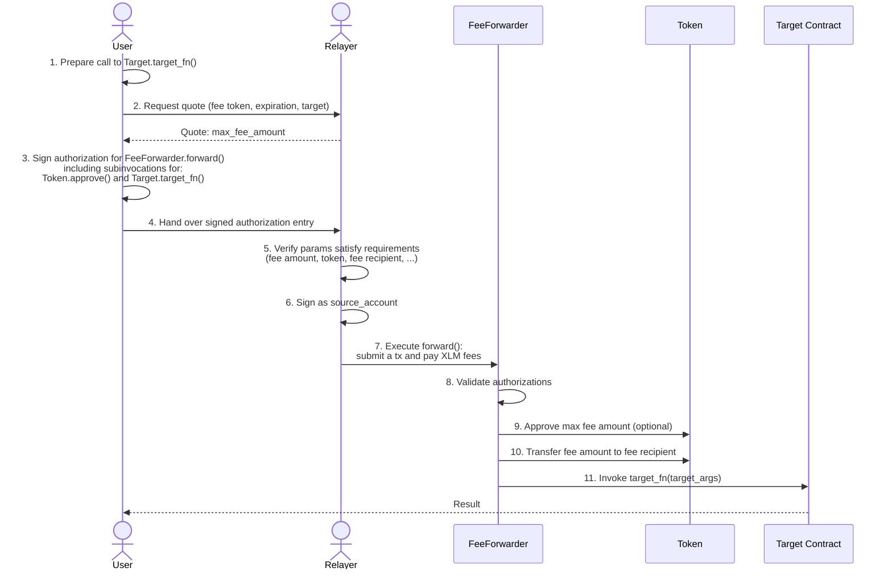

# Fee Abstraction

Utilities for implementing fee abstraction (fee forwarding) for interacting with Soroban contracts, allowing users to pay transaction fees in tokens (e.g., USDC) instead of native XLM.

## Overview

Fee abstraction enables a better UX by letting users pay for transactions with tokens they already hold. Another actor, called relayer, covers the XLM network fees and is compensated in the user's chosen token. 

The flow involves an off-chain negotiation between the user and a relayer (quote request, fee agreement), but the actual execution happens through an intermediary contract called **FeeForwarder**. This contract enforces that the user is charged at most `max_fee_amount` (the cap they signed). The relayer determines the actual `fee_amount` at submission time based on network conditions, but can never exceed the user's authorized maximum.

## Features

- Fee Collection Helpers (eager and lazy approval strategies)
- Invoker Helper handling user-side authorizations
- Optional Fee Token Allowlist
- Optional Token Sweeping (fees are collected on the forwarding contract and transferred later on)
- Validation Utilities

## Examples

- [fee-forwarder-permissioned](../../examples/fee-forwarder-permissioned)

  - Only trusted executors can call `forward`.
  - The forwarder contract itself collects the fees, which can be swept later.

- [fee-forwarder-permissionless](../../examples/fee-forwarder-permissionless)
  - Anyone can call `forward`; there is no executor allowlist.
  - The relayer (transaction submitter) receives the collected fee.

Together, these examples show how to combine the auth helper
(`auth_user_and_invoke`) with the shared fee collection helper (`collect_fee`)
by selecting the appropriate [`FeeAbstractionApproval`] strategy (`Eager` or
`Lazy`) for different use cases.
