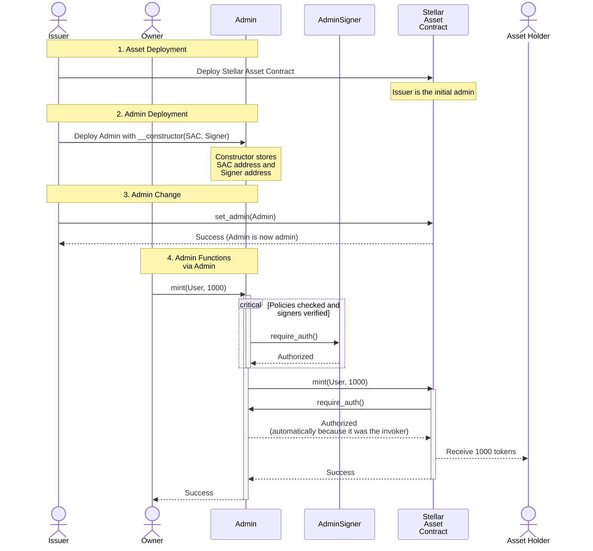

```mermaid
sequenceDiagram
    actor Issuer
    actor Owner
    participant Admin
    participant AdminSigner
    participant SAC as Stellar<br/>Asset<br/>Contract
    actor User as Asset Holder
    
    Note over Issuer,Admin: 1. Asset Deployment
    Issuer->>SAC: Deploy Stellar Asset Contract
    Note over SAC: Issuer is the initial admin
    
    Note over Issuer,Admin: 2. Admin Deployment
    Issuer->>Admin: Deploy Admin with __constructor(SAC, Signer)
    Note over Admin: Constructor stores<br/>SAC address and<br/>Signer address
    
    Note over Issuer,Admin: 3. Admin Change
    Issuer->>SAC: set_admin(Admin)
    SAC-->>Issuer: Success (Admin is now admin)
    
    Note over Owner,Admin: 4. Admin Functions<br/>via Admin
    Owner->>Admin: mint(User, 1000)
    activate Admin
    activate Admin
    critical Policies checked and signers verified
    Admin->>AdminSigner: require_auth()
    AdminSigner-->>Admin: Authorized
    end
    deactivate Admin
    Admin->>SAC: mint(User, 1000)
    activate SAC
    SAC->>Admin: require_auth()
    Admin-->>SAC: Authorized<br/>(automatically because it was the invoker)
    SAC-->>User: Receive 1000 tokens
    SAC-->>Admin: Success
    deactivate SAC
    Admin-->>Owner: Success
    deactivate Admin
    
```
